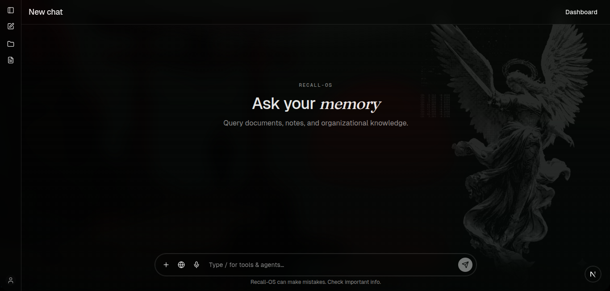

<div align="center">

```text
 ██████╗ ███████╗ ██████╗ █████╗ ██╗     ██╗           ██████╗ ███████╗
 ██╔══██╗██╔════╝██╔════╝██╔══██╗██║     ██║          ██╔═══██╗██╔════╝
 ██████╔╝█████╗  ██║     ███████║██║     ██║    ████╗ ██║   ██║███████╗
 ██╔══██╗██╔══╝  ██║     ██╔══██║██║     ██║          ██║   ██║╚════██║
 ██║  ██║███████╗╚██████╗██║  ██║███████╗███████╗     ╚██████╔╝███████║
 ╚═╝  ╚═╝╚══════╝ ╚═════╝╚═╝  ╚═╝╚══════╝╚══════╝      ╚═════╝ ╚══════╝
```

### 🧠 Organizational memory for your documents · **v1.0.0**

Upload documents. Index them. Ask questions with hybrid retrieval and source citations.

[](https://bun.sh)
[](https://nextjs.org)
[](https://prisma.io)
[](https://qdrant.tech)
[](https://langfuse.com)

</div>

---

## ✨ What is RecallOS?



### Quick setup

A **multimodal memory architecture** for persistent retrieval over heterogeneous enterprise knowledge. Upload PDFs, images, audio, and video — then chat with an AI that cites its sources.

```bash
curl -fsSL https://raw.githubusercontent.com/Aadit032/RecallOS/refs/heads/main/setup.sh | bash
```

### 🚀 Core Features

| Feature | Description |
|:--------|:------------|
| 📄 **Multi-modality upload** | PDF, images, audio, video via MinIO presigned URLs |
| 🏭 **Modality-aware ingestion** | Per-modality parser workers dispatched by MIME type |
| 🧩 **Decoupled embedding** | Modality-agnostic dense + sparse embed, re-embeddable without reparsing |
| 🔍 **Hybrid search** | Dense BGE + sparse SPLADE in Qdrant, fused with RRF |
| 🎯 **Cross-encoder rerank** | Top chunks reranked before LLM context injection |
| 💬 **Streaming chat** | SSE streaming with source chunk citations + optional modality filter |
| 🌐 **Web research agent** | `/web` prefix triggers LangGraph loop (Exa → reason → refine → answer) |
| 📂 **Projects** | Organize chats with custom system prompts |
| 📌 **Chat history** | Pin, delete, version (edit/resend), and rolling conversation summaries |
| 📊 **Langfuse tracing** | Full observability for chat RAG and ingestion pipelines |
| 🔄 **Dead Letter Queue** | Failed document processing with retry and reprocessing |
| 🏗️ **Modular chat UI** | 14-file component architecture with custom hooks and focused modules |

---

## 🛠️ Tech Stack

<table>
<tr><th>Layer</th><th>Technology</th></tr>
<tr><td>📦 Monorepo</td><td>Bun workspaces + Turborepo</td></tr>
<tr><td>🖥️ Frontend</td><td>Next.js 16 (App Router), React 19, Tailwind CSS v4</td></tr>
<tr><td>⚙️ Backend</td><td>Express 5 (JWT middleware on all routes except auth)</td></tr>
<tr><td>⚡ Runtime</td><td>Bun</td></tr>
<tr><td>🔐 Auth</td><td>JWT + bcrypt</td></tr>
<tr><td>📨 Queue</td><td>Redis Streams (consumer groups, XAUTOCLAIM)</td></tr>
<tr><td>🗄️ Object storage</td><td>MinIO (S3 API)</td></tr>
<tr><td>🐘 Metadata</td><td>PostgreSQL + Prisma 7</td></tr>
<tr><td>🧭 Vectors</td><td>Qdrant (dense + sparse named vectors)</td></tr>
<tr><td>📐 Dense embeddings</td><td>BGE-small-en (<code>fastembed</code>)</td></tr>
<tr><td>🔤 Sparse embeddings</td><td>SPLADE++ EN v1 (<code>fastembed</code>)</td></tr>
<tr><td>🎯 Rerank</td><td>Hugging Face cross-encoder (<code>ms-marco-MiniLM-L6-v2</code>)</td></tr>
<tr><td>📑 Parsing</td><td>LlamaParse (LlamaCloud)</td></tr>
<tr><td>🤖 LLM</td><td>OpenRouter</td></tr>
<tr><td>🌐 Web search</td><td>Exa + LangGraph agent</td></tr>
<tr><td>🔭 Observability</td><td>Langfuse (OpenTelemetry)</td></tr>
</table>

---

## 🏗️ Architecture

```text
  ┌────────────┐         presigned PUT          ┌────────┐
  │  Next.js   │ ─────────────────────────────▶ │ MinIO  │
  │    web     │                                │(assets)│
  └─────┬──────┘                                └───┬────┘
        │                                           │
        │ REST (JWT)                                │ object key
        ▼                                           │
  ┌─────┬──────┐    xAdd to files_stream       ┌────▼─────┐
  │  Express   │ ───────────────────────────▶  │  Redis   │
  │  backend   │                               │ Streams  │
  └─────┬──────┘                               └───┬──────┘
        │                                          │
        │ hybrid query + chat                      │ Dispatcher
        │                                          │ (routes by MIME)
        ▼                                          ▼
  ┌───────────┐                            ┌───────┬────────┐
  │  Qdrant   │                            │ pdf_stream     │
  │ dense +   │ ◀─── embed_stream          │ image_stream   │
  │ splade    │                            │ audio_stream   │
  └───────────┘    embedding worker        │ video_stream   │
                                           └───────┬────────┘
        │                                          │
        │             ┌───────────┐                │
        └──────────▶  │ Postgres  │ ◀──────────────┘
                      │  + users  │    Parser workers
                      │  + docs   │    (per modality)
                      │  + chunks │
                      │  + chats  │
                      └───────────┘
```

---

## 🔄 Ingestion Pipeline

Documents of any modality are accepted (PDF, images, audio, video).

```text
 ┌──────┐   presigned URL    ┌───────┐    bytes      ┌───────┐
 │Client│ ─────────────────▶ │Express│ ────────────▶ │ MinIO │
 └──┬───┘                    └───┬───┘               └───────┘
    │                            │
    │ POST /confirm              │
    ▼                            ▼
 ┌──────────┐  xAdd  ┌──────────────┐
 │ Document │ ─────▶ │ files_stream │
 │ UPLOADED │        └──────┬───────┘
 └──────────┘               │ Dispatcher
                            │ (MIME detection)
          ┌─────────────────┼─────────────────┐
          ▼                 ▼                 ▼
   ┌────────────┐   ┌────────────┐     ┌────────────┐
   │ pdf_stream │   │image_stream│ ... │video_stream│
   └─────┬──────┘   └─────┬──────┘     └─────┬──────┘
         │                 │                 │
         ▼                 ▼                 ▼
   ┌───────────┐    ┌───────────┐      ┌───────────┐
   │  QUEUED   │    │  PARSING  │      │   PARSED  │
   └─────┬─────┘    └─────┬─────┘      └─────┬─────┘
         │                │                  │
         ▼                ▼                  ▼
   ┌──────────────────────────────┐     ┌──────────────┐
   │   ParsedChunkSet + Chunks    │──▶  │ embed_stream │
   │   (Postgres)                 │     └─────┬────────┘
   └──────────────────────────────┘           │
                                              ▼
                                        ┌───────────┐
                                        │ EMBEDDING │
                                        └─────┬─────┘
                                              │
                                   ┌──────────┴────────────┐
                                   ▼                       ▼
                         ┌───────────┐             ┌───────────┐
                         │  Qdrant   │             │   READY   │
                         │  vectors  │             │ (or FAIL) │
                         └───────────┘             └───────────┘
```

> **Recovery**: Each stream has its own consumer group. Workers run a stale-job reclaimer (`XAUTOCLAIM`). After `MAX_RETRIES`, jobs move to a **Dead Letter Queue** (`dlq_stream`).

---

## 🔍 Retrieval & Chat

```text
  ┌──────────────────┐
  │   User message   │
  └────────┬─────────┘
           ▼
  ┌──────────────────┐
  │ Embed query      │
  │ dense BGE +      │
  │ sparse SPLADE    │
  └────────┬─────────┘
           ▼
  ┌──────────────────┐
  │ Qdrant hybrid    │  prefetch dense top-50
  │ query            │  prefetch sparse top-50
  │                  │  fuse with RRF → top 50
  │                  │  (filtered by user's docs)
  └────────┬─────────┘
           ▼
  ┌──────────────────┐
  │ Cross-encoder    │
  │ rerank → top 5   │
  └────────┬─────────┘
           ▼
  ┌──────────────────┐
  │ System prompt +  │
  │ recent history + │
  │ project prompt   │
  └────────┬─────────┘
           ▼
  ┌──────────────────┐
  │ OpenRouter SSE   │
  │ stream           │
  └────────┬─────────┘
           ▼
  ┌──────────────────┐
  │ Answer + sources │
  │ stored on msg    │
  └──────────────────┘
```

### 💬 Chat Features

| Feature | Details |
|:--------|:--------|
| 🔄 Streaming replies | Real-time SSE streaming from OpenRouter |
| 📎 Source citations | Each answer carries ranked chunk references |
| 📂 Projects | Organize chats with custom system prompts |
| 📌 Pin / delete | Manage chat history |
| ✏️ Edit & resend | Create version branches (1/2, 2/2) |
| 🌐 Web mode | `/web` prefix triggers LangGraph research agent |
| 📊 Live agent steps | Watch the web agent search, reason, and refine in real-time |
| 📝 Conversation summaries | Rolling summaries injected into later prompts |

---

## 🔌 API Surface

Base path: `/api/v1` (JWT middleware on all routes except `/auth/*`).

| Area | Methods | Description |
|:-----|:--------|:------------|
| 🔐 **Auth** | `POST /auth/signup`, `POST /auth/signin` | User registration & login |
| 📤 **Upload** | `POST /upload/post-file-url`, `POST /upload/confirm` | Presigned URL flow |
| 📄 **Documents** | `GET /download/list`, `POST /download/get-download-url`, `DELETE /download/:id` | File management |
| 💬 **Chat** | `GET /chat`, `GET /chat/:id`, `PATCH /chat/:id`, `DELETE /chat/:id`, `POST /chat/message` | Chat CRUD + SSE streaming |
| 📂 **Projects** | `GET/POST /projects`, `PATCH/DELETE /projects/:id` | Project management |

---

## 🖥️ Frontend Routes

| Route | Purpose |
|:------|:--------|
| `/` | Landing page (redirects to chat if signed in) |
| `/signin`, `/signup` | Authentication |
| `/dashboard` | Upload documents, view status, download / delete |
| `/chat` | Full chat UI with history, projects, sources, web agent |

---

## 🗃️ Data Model (Postgres)

| Model | Role |
|:------|:-----|
| `User` | Username + hashed password |
| `Document` | Title, object key, `mimeType`, `modality`, status (`UPLOADED` → `READY` / `FAILED`) |
| `ParsedChunkSet` | Group of parsed chunks per modality, status (`PARSED` / `INDEXED`) |
| `ParsedChunk` | Individual text chunk with JSON metadata (page, timestamp, caption, OCR, etc.) |
| `Project` | Named workspace + optional system prompt |
| `Chat` | Title, pin, optional project, summary fields |
| `Message` | role, content, `sourceChunks` JSON |
| `Memory` | Schema for durable facts (not wired into chat yet) |

> Chunk vectors live in **Qdrant** with payload including `documentId`, `chunkId`, `modality`, `page`, `timestamps`, `caption`.

---

## 💾 Storage Roles

| Store | What it holds |
|:------|:--------------|
| 🗄️ **MinIO** | Original asset files (PDF, images, audio, video) |
| 🐘 **PostgreSQL** | Users, docs, chunk sets, chunks, chats, messages, projects |
| 📨 **Redis Streams** | Multi-stream job queue per modality + consumer group PEL + DLQ |
| 🧭 **Qdrant** | Per-chunk dense + SPLADE vectors and text payload |

> There is **no OpenSearch** — lexical signal comes from **SPLADE sparse vectors** inside Qdrant, fused with dense cosine via RRF.

---

## 🔭 Observability

`@repo/langfuse` instruments:

| Pipeline | Traced steps |
|:---------|:-------------|
| 💬 Chat RAG | `hybrid-retrieve` → `cross-encode-rerank` → `generate-response` |
| 🌐 Web agent | LangGraph nodes (search → reason → refine → answer) |
| 📄 Ingest | `process-document` and nested per-modality steps |

If Langfuse keys are missing, tracing **no-ops** silently.

---

**Key design decisions:**
- 🪝 **Custom hook** (`useChatState`) encapsulates ~50 state variables and all SSE streaming logic
- 🧩 **Presentational components** are pure — they receive props and render
- 📦 **Types & helpers** are shared across all modules via local imports
- 🔌 **Zero changes** to the route import (`import ChatPage from "@/components/chat-app"` resolves to `index.tsx`)

---

## 🏃 Local Development

### 📋 Prerequisites

- [Docker](https://docs.docker.com/get-docker/)
- [Bun](https://bun.sh) ≥ 1.3
- [ffmpeg](https://ffmpeg.org) *(only needed for video & scene workers)*
- API keys: **LlamaCloud**, **OpenRouter**; optional: HF, Exa, Langfuse

### ⚡ One-shot Setup

The setup script starts all Docker services, clones the repo (if needed), installs dependencies, and runs migrations:

```bash
# From repo root
bash scripts/setup.sh
```

### 🐳 Docker Services

The four backing services run in Docker. The setup script handles this, but if you prefer manual control:

```bash
# PostgreSQL
docker run -d --name recallos-postgres \
  -p 5432:5432 \
  -e POSTGRES_USER=postgres \
  -e POSTGRES_PASSWORD=password \
  -e POSTGRES_DB=recallOs \
  --restart unless-stopped \
  postgres:16-alpine

# Redis
docker run -d --name recallos-redis \
  -p 6379:6379 \
  --restart unless-stopped \
  redis:7-alpine

# MinIO (S3-compatible object storage)
docker run -d --name recallos-minio \
  -p 9000:9000 \
  -p 9001:9001 \
  -e MINIO_ROOT_USER=admin \
  -e MINIO_ROOT_PASSWORD=password123 \
  --restart unless-stopped \
  minio/minio server /data --console-address ":9001"

# Qdrant (vector DB)
docker run -d --name recallos-qdrant \
  -p 6333:6333 \
  -p 6334:6334 \
  --restart unless-stopped \
  qdrant/qdrant
```

| Service | URL | Credentials |
|:--------|:----|:------------|
| Postgres | `localhost:5432` | `postgres` / `password` |
| Redis | `localhost:6379` | — |
| MinIO API | `http://localhost:9000` | `admin` / `password123` |
| MinIO Console | `http://localhost:9001` | `admin` / `password123` |
| Qdrant | `http://localhost:6333` | — |

### 🎬 ffmpeg (Video Workers)

The video and scene workers require `ffmpeg` and `ffprobe` on your PATH. If ffmpeg is missing, all other workers (PDF, image, audio, embedder, dispatcher, DLQ) still run normally — only video processing is disabled.

```bash
# Debian / Ubuntu
sudo apt install ffmpeg

# macOS
brew install ffmpeg
```

### 🔧 Manual Setup (without the script)

```bash
# 1. Install dependencies
bun install

# 2. Copy env file and fill in API keys
cp .env.example .env
#    Required:  LLAMA_CLOUD_API_KEY, OPENROUTER_API_KEY
#    Optional:  EXA_API_KEY, HF_TOKEN, LANGFUSE_*

# 3. Generate Prisma client & apply migrations
cd packages/db && bunx prisma migrate dev

# 4. Start everything
cd ../..
bun run dev
```

### 🎯 Run Individually

```bash
bun run --filter web dev                 # Next.js on :3001
bun run --filter backend dev             # Express on :3000
bun run --filter workers dev             # All workers
bun run --filter workers dev:pdf         # PDF worker only
bun run --filter workers dev:embedder    # Embedder only
bun run --filter workers dev:dlq         # DLQ worker only
```

### 📝 All Commands

| Command | Purpose |
|:--------|:--------|
| `bun install` | Install dependencies |
| `bun run dev` | Start all apps via Turborepo |
| `bun run build` | Production build |
| `bun run lint` | ESLint (web: `--max-warnings 0`) |
| `bun run check-types` | TypeScript check |
| `bun run format` | Prettier (`--write`) |
| `cd packages/db && bunx prisma migrate dev` | Apply migrations |

### 🧹 Teardown

```bash
docker stop recallos-postgres recallos-redis recallos-minio recallos-qdrant
docker rm recallos-postgres recallos-redis recallos-minio recallos-qdrant
```

---

## 🧭 Design Principles

| Principle | Description |
|:----------|:------------|
| ⚡ **Async ingest** | Uploads never block on parse/embed |
| 🔍 **Hybrid retrieval** | Dense meaning + sparse terms, fused with RRF |
| 📎 **Source grounded** | Answers carry chunk citations |
| 🔒 **User scoped** | Retrieval and deletes are filtered by ownership |
| 🧩 **Modular monorepo** | Shared clients in `packages/*` |
| 🔭 **Observable** | Optional Langfuse traces end to end |
| 🔌 **Decoupled parsing & embedding** | Re-embed without reparsing via `ParsedChunkSet` |
| ➕ **Extensible modalities** | New types need only a new parser worker |

---

<div align="center">

### 🧠 RecallOS

**Search your knowledge. Cite your sources.**

</div>
