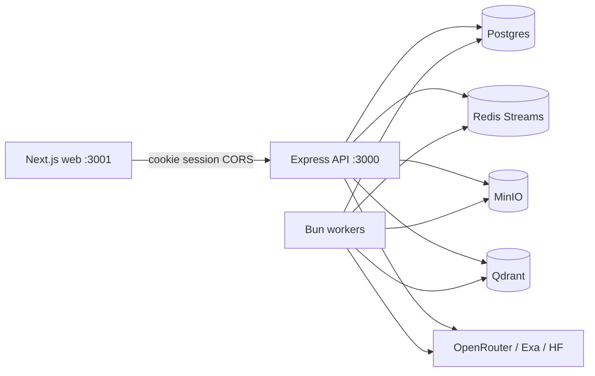

# RecallOS Documentation

Welcome to the technical documentation for **RecallOS** — a multimodal organizational memory platform for documents, chat, and hybrid retrieval.

## Contents

| Document | Description |
|----------|-------------|
| [Architecture](./architecture.md) | System design, components, data model, packages |
| [Diagrams](./diagrams.md) | Mermaid system, data-flow, ER, and deployment diagrams |
| [Sequence diagrams](./sequence-diagrams.md) | End-to-end request flows (auth, upload, chat, workers, connectors) |
| [API reference](./api.md) | HTTP API, auth, request/response shapes, SSE events |
| [Onboarding guide](./onboarding.md) | New developer setup, day-one tasks, conventions |
| [Deployment guide](./deployment.md) | Production configuration, services, scaling, checklist |
| [Disaster recovery](./disaster-recovery.md) | Backups, restore, failure modes, RTO/RPO guidance |
| [Security audit](../audit.md) | Security findings and remediations |

## Quick links

- **Local setup:** [Onboarding](./onboarding.md) or root [README](../README.md)
- **Run stack:** `bun run dev` (web `:3001`, API `:3000`, workers)
- **Agent guide:** [AGENTS.md](../AGENTS.md)
- **Security:** [audit.md](../audit.md)

## Tech at a glance

## Document conventions

- Paths are relative to the monorepo root unless noted.
- API base path: `http://localhost:3000/api/v1` (auth: `/api/auth/*`).
- All `/api/v1/*` routes require a Better Auth session cookie.
- Diagrams use [Mermaid](https://mermaid.js.org/) (renderable on GitHub and most Markdown viewers).
