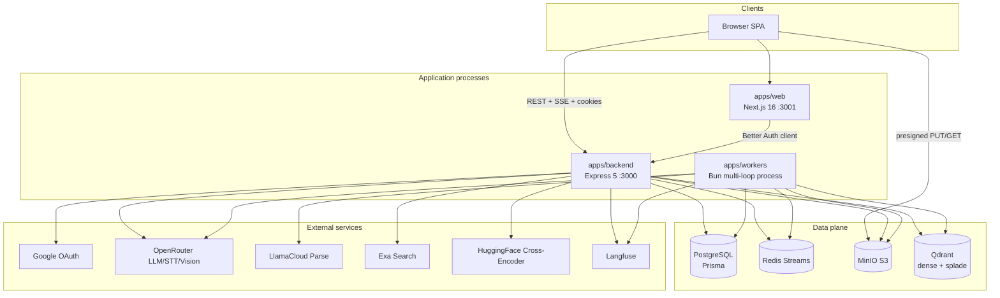
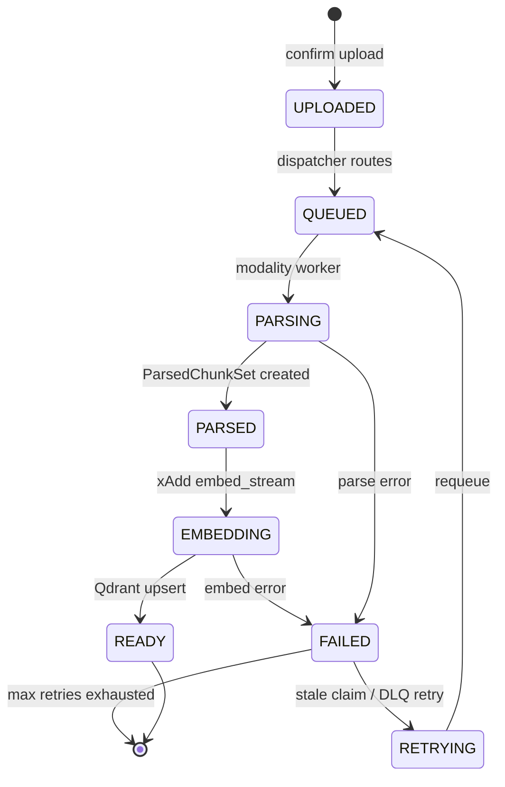
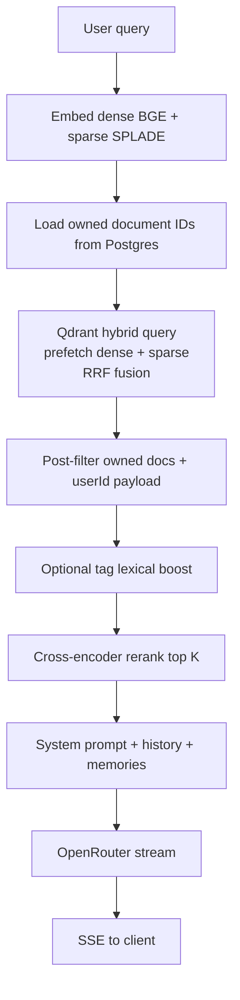

# Architecture

This document describes how RecallOS is structured: processes, packages, data stores, ingestion, retrieval, and chat modes.

---

## 1. Product goals

RecallOS is a **multimodal personal / organizational memory** system:

1. **Ingest** PDFs, images, audio, video (and connector text) asynchronously.
2. **Index** chunks with dense (BGE) + sparse (SPLADE) vectors in Qdrant.
3. **Retrieve** with hybrid RRF + cross-encoder rerank, scoped to the authenticated user.
4. **Chat** with streaming answers, source citations, optional web research and multi-hop library agents.
5. **Remember** durable user facts across sessions; sync external sources via connectors.

Design principles:

| Principle | Implementation |
|-----------|----------------|
| Async ingest | Upload → MinIO → Redis Streams → modality workers → embed |
| Hybrid retrieval | Dense + sparse prefetch, RRF fusion, HF cross-encoder |
| Source grounded | Chunk IDs, page/timestamp metadata, object keys for UI |
| User scoped | Session `userId` on all queries; Qdrant filtered by owned docs |
| Decoupled parse/embed | `ParsedChunkSet` can be re-embedded without reparse |
| Observable | Optional Langfuse OpenTelemetry traces |

---

## 2. High-level system



### Process roles

| Process | Port | Responsibility |
|---------|------|----------------|
| `apps/web` | 3001 | UI: dashboard, chat, auth pages |
| `apps/backend` | 3000 | Auth, REST API, chat SSE, connector sync loop |
| `apps/workers` | — | Dispatcher, modality parsers, scene, embedder, DLQ |

---

## 3. Monorepo layout

```text
RecallOS/
├── apps/
│   ├── web/                 # Next.js App Router UI
│   ├── backend/             # Express API + agents + security
│   └── workers/             # Ingestion pipeline workers
├── packages/
│   ├── db/                  # Prisma schema, migrations, client (@repo/prisma)
│   ├── minio/               # S3 client (@repo/minio)
│   ├── redis-stream/        # Redis Streams helpers (@repo/redis-stream)
│   ├── qdrant/              # Qdrant client (@repo/qdrant)
│   ├── embed/               # Dense + sparse + cross-encoder (@repo/embed)
│   ├── openrouter/          # OpenRouter SDK wrapper
│   ├── langfuse/            # Tracing helpers
│   ├── eslint-config/
│   ├── typescript-config/
│   └── ui/                  # Shared UI primitives
├── docs/                    # This documentation
├── scripts/setup.sh
└── audit.md
```

### Package export pattern

Shared packages re-export via `./client`:

```ts
import { prismaClient } from "@repo/prisma/client";
import { s3 } from "@repo/minio/client";
import { qdrantClient } from "@repo/qdrant/client";
```

---

## 4. Backend architecture

```text
apps/backend/
├── index.ts                 # Express app, CORS, rate limits, routes
├── auth.ts                  # Better Auth (Google OAuth + sessions)
├── middleware.ts            # Session → req.userId
├── routers/                 # HTTP route handlers
├── services/                # Business logic (chat, hybrid retrieve, upload, connectors)
├── agents/                  # LangGraph web + memory agents
└── security/                # SSRF, upload policy, prompt fences, rate limit
```

### Request pipeline

1. CORS (`FRONTEND_URL`, credentials)
2. Better Auth handler on `/api/auth/*` (before `express.json`)
3. JSON body limit 1 MB
4. Session middleware on `/api/v1/*`
5. Per-route rate limiters
6. Router handlers (Zod validation where applicable)

### Chat modes

| Mode | Trigger | Behavior |
|------|---------|----------|
| **Memory (RAG)** | Default message | Hybrid retrieve → rerank → stream LLM |
| **Web** | Message starts with `/web` | LangGraph + Exa search loop |
| **Agent** | `/agent` or `agentMode: true` | Multi-hop RAG plan → retrieve → reason → answer |

---

## 5. Ingestion pipeline



### Redis streams

| Stream | Group | Consumer role |
|--------|-------|---------------|
| `files_stream` | `files-workers` | Dispatcher routes by MIME |
| `pdf_stream` | `pdf-workers` | LlamaParse + chunk |
| `image_stream` | `image-workers` | Vision caption/chunk |
| `audio_stream` | `audio-workers` | STT + chunk |
| `video_stream` | `video-workers` | Scene + audio path |
| `scene_stream` | `scene-workers` | Scene keyframes/clips |
| `embed_stream` | `embedding-workers` | Dense + sparse → Qdrant |
| `dlq_stream` | `dlq-workers` | Dead letter handling |

Workers use consumer groups + **XAUTOCLAIM**-style stale reclaim (`claimStaleJobs`) after idle thresholds; after max retries, jobs go to the DLQ.

### Object keys (uploads)

```text
uploads/{userId}/{modality}/{uuid}-{safeFileName}
```

Confirm enforces user ownership of the key prefix. Max size: `MAX_UPLOAD_BYTES` (default 100 MiB).

### Connector ingest

Connectors (URL, RSS, GitHub, Notion-style URL) fetch text (with SSRF protections), write a text object to MinIO, create `Document` + `ParsedChunkSet` directly, and push to `embed_stream` (bypass PDF parser).

---

## 6. Retrieval architecture



**Tenant isolation:** Qdrant queries always include a filter on `documentId ∈ ownedDocumentIds`, with a secondary payload check.

**Typical limits:** hybrid top 50 (configurable up to 200), chat rerank top 5, search aggregates chunks by document.

---

## 7. Data model (logical)

Core entities (see Prisma schema `packages/db/prisma/schema.prisma`):

| Entity | Purpose |
|--------|---------|
| `User` | Account (OAuth + username) |
| `Session` / `Account` / `Verification` | Better Auth |
| `Document` | Uploaded or connector asset + status |
| `ParsedChunkSet` / `ParsedChunk` | Parse output before/for embedding |
| `Chat` / `Message` | Conversations + source citations JSON |
| `Project` | Optional system prompt grouping chats |
| `Memory` | Long-term user facts |
| `Connector` / `ConnectorSyncJob` | External sync |

Full ER diagram: [diagrams.md](./diagrams.md#entity-relationship).

---

## 8. Frontend architecture

```text
apps/web/
├── app/                     # Routes: /, /chat, /dashboard, /signin, /signup
├── components/chat-app/     # Modular chat UI (14 files)
└── lib/api/                 # Axios clients (credentials: true)
```

Chat UI modules (`components/chat-app/`):

| File | Role |
|------|------|
| `index.tsx` | Orchestrator |
| `use-chat-state.ts` | State, fetching, SSE |
| `chat-sidebar.tsx` | Sessions / projects |
| `chat-messages.tsx` | Bubbles + streaming |
| `composer.tsx` | Input, upload, modes |
| `markdown-content.tsx` | GFM + KaTeX (safe links) |
| `source-panel.tsx` | Citations |
| `agent-steps.tsx` | Web/agent progress |

Auth: Better Auth React client → backend `BETTER_AUTH_URL` (default `http://localhost:3000`).

---

## 9. Security architecture (summary)

| Control | Mechanism |
|---------|-----------|
| Auth | Better Auth session cookies, Google OAuth |
| API authz | `middleware` sets `req.userId`; queries filter by owner |
| Uploads | User-scoped keys, MIME allowlist, size caps |
| SSRF | URL validation + DNS private-IP checks on connectors |
| Prompt injection | Untrusted fences + policy text in LLM prompts |
| Rate limits | In-process per-user limiters |
| Secrets | Env files gitignored; `BETTER_AUTH_SECRET` required ≥32 chars |

Details: [audit.md](../audit.md).

---

## 10. Observability

- **Langfuse** via `@repo/langfuse` — no-ops if keys missing.
- Traces: chat turns, hybrid retrieve, generations, worker steps (when enabled).
- Application logs: structured `[component]` prefixes on backend and workers.

---

## 11. Scalability notes

| Layer | Scale approach |
|-------|----------------|
| Web | Stateless Next.js replicas behind CDN |
| API | Stateless Express replicas (rate limits need Redis for multi-instance) |
| Workers | Multiple processes with distinct `WORKER_ID`; Redis consumer groups |
| Postgres | Vertical + read replicas; connection pooling |
| Redis | Managed Redis; persistence for streams if required |
| Qdrant | Cluster / shards as collection grows |
| MinIO | Distributed mode or managed S3 |

---

## 12. Related docs

- [Diagrams](./diagrams.md)
- [Sequence diagrams](./sequence-diagrams.md)
- [API](./api.md)
- [Deployment](./deployment.md)
- [Disaster recovery](./disaster-recovery.md)
