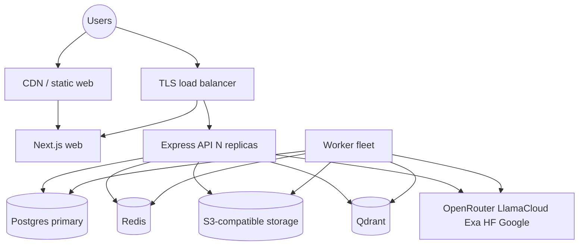

# Deployment guide

How to run RecallOS beyond local Docker containers. There is **no official Docker Compose / Kubernetes chart in-repo yet**; this guide is the production blueprint.

---

## 1. Architecture for production



### Components to deploy

| Component | Runtime | Scaling |
|-----------|---------|---------|
| Web | Node/Bun Next.js standalone or container | Horizontal |
| API | Bun/Node Express | Horizontal (sticky cookies optional; sessions in DB) |
| Workers | Bun process(es) | Horizontal via Redis consumer groups + unique `WORKER_ID` |
| Postgres | Managed preferred | HA primary + backups |
| Redis | Managed preferred | Persistence if streams must survive restarts |
| Object storage | MinIO cluster or AWS S3 | Multi-AZ |
| Qdrant | Cloud or self-hosted cluster | Disk + RAM for vectors |

---

## 2. Prerequisites

- Domain names: e.g. `app.example.com` (web), `api.example.com` (API)  
- TLS certificates (load balancer or reverse proxy)  
- Google OAuth client for **production** redirect URIs  
- Secrets store (Vault, AWS Secrets Manager, Doppler, etc.)  
- Outbound network access to OpenRouter, LlamaCloud, Google, Exa, HF as needed  

---

## 3. Configuration

### 3.1 Required environment variables

Copy from `.env.example` and override for production:

| Variable | Production notes |
|----------|------------------|
| `DATABASE_URL` | SSL Postgres URL; strong password |
| `REDIS_URL` | TLS Redis if available |
| `MINIO_ENDPOINT` / AWS S3 endpoint | Private network preferred |
| `MINIO_ACCESSKEYID` / `MINIO_SECRET_ACCESS_KEY` | Or IAM role for S3 |
| `AWS_BUCKET_NAME` | Private bucket; no public ACL |
| `PORT` | API listen port (proxy terminates TLS) |
| `FRONTEND_URL` | Exact web origin `https://app.example.com` |
| `BETTER_AUTH_URL` | Exact API public origin `https://api.example.com` |
| `BETTER_AUTH_SECRET` | ≥32 random bytes; never rotate without session wipe plan |
| `GOOGLE_CLIENT_ID` / `SECRET` | Prod OAuth client |
| `LLAMA_CLOUD_API_KEY` | Prod key |
| `OPENROUTER_API_KEY` | Prod key + spend limits |
| Stream names / groups | Keep consistent across API + all workers |
| `WORKER_ID` | Unique per worker process |
| `HOST` / `COLLECTION` / `DENSE_DIM` | Qdrant host + collection (384 for BGE-small) |
| `MAX_UPLOAD_BYTES` | Align with proxy body limits and cost budget |
| `CHAT_MODEL` / vision / whisper models | Pin stable model IDs |

Optional: `EXA_API_KEY`, `HF_TOKEN`, `LANGFUSE_*`, `CONNECTOR_SYNC_POLL_MS`.

### 3.2 Auth & cookies

- Set `FRONTEND_URL` and `BETTER_AUTH_URL` to **HTTPS** production URLs.  
- Secure cookies enable automatically when not localhost.  
- If web and API are on different sites, ensure CORS + cookie `SameSite` strategy still works (`lax` + same-site parent domain preferred; cross-site may need `none` + secure—test carefully).  
- Register Google redirect: `{BETTER_AUTH_URL}/api/auth/callback/google`.

### 3.3 Web client env

```bash
NEXT_PUBLIC_BETTER_AUTH_URL=https://api.example.com
```

Update hardcoded API bases in `apps/web/lib/api.ts` (currently `http://localhost:3000/api/v1`) to production API URL or env-driven config before go-live.

---

## 4. Build

```bash
bun install --frozen-lockfile
bun run build
cd packages/db && bunx prisma migrate deploy
```

Use `migrate deploy` in CI/CD (not `migrate dev`).

### Suggested process commands

```bash
# API
cd apps/backend && bun index.ts

# Workers
cd apps/workers && bun index.ts

# Web (after next build)
cd apps/web && bun run start   # or next start -p 3001
```

Pin Bun/Node versions in the image.

---

## 5. Data stores setup

### Postgres

1. Create database and role with least privilege.  
2. Run `prisma migrate deploy`.  
3. Enable automated backups (see [disaster recovery](./disaster-recovery.md)).  
4. Connection pooling (PgBouncer) if many API/worker replicas.

### Redis

1. Enable AOF or RDB if you need stream durability across restarts.  
2. Network-restrict to app subnets.  
3. Monitor memory; streams grow with lagging consumers.

### Object storage

1. Create private bucket `AWS_BUCKET_NAME`.  
2. CORS on bucket must allow browser PUT from `FRONTEND_URL` for presigned uploads.  
3. Lifecycle rules optional (abort incomplete multipart).  
4. Server-side encryption (SSE-S3/KMS).

### Qdrant

1. Create collection with named vectors: dense dim `DENSE_DIM` (384) + sparse SPLADE.  
2. Ensure payload indexes for `documentId` (and optionally `userId`, `modality`) if recommended for filters.  
3. Snapshot schedule for DR.

---

## 6. Networking & security

| Control | Recommendation |
|---------|----------------|
| TLS | Terminate at LB; internal mTLS optional |
| Firewall | DB/Redis/MinIO/Qdrant not public |
| Secrets | Inject at runtime; never bake into images |
| Non-root | Containers run as non-root user |
| Rate limits | API has in-process limits; add gateway limits for multi-replica |
| WAF | Optional on public paths |
| SSRF | Connectors already block private IPs; keep workers egress filtered |
| CORS | Single trusted `FRONTEND_URL` |
| Headers | API sets nosniff / frame deny; add CSP on web when ready |

See [audit.md](../audit.md) for application-level controls already implemented.

---

## 7. Scaling workers

```bash
# Replica 1
WORKER_ID=worker-a bun apps/workers/index.ts

# Replica 2
WORKER_ID=worker-b bun apps/workers/index.ts
```

- Same stream/group names; different `WORKER_ID`.  
- Consumer groups distribute messages.  
- Stale claim loops reclaim abandoned work.  
- Scale embedder carefully (CPU for ONNX models).  
- ffmpeg-heavy video workers may need larger CPU/RAM pods.

---

## 8. Observability

| Signal | Tool |
|--------|------|
| Traces | Langfuse (`LANGFUSE_TRACING_ENABLED=true`) |
| Logs | stdout JSON/structured → aggregator |
| Metrics | Process health, queue lag (`XPENDING`), Qdrant, Postgres |
| Alerts | Error rate, DLQ growth, disk, 5xx, OAuth failures |

Health checks (add if missing in your deploy):

- API: TCP/HTTP on `PORT`  
- Workers: process alive + Redis connectivity  
- Web: `/` 200  

---

## 9. CI/CD checklist

```text
[ ] bun install
[ ] lint / check-types
[ ] build web + packages
[ ] prisma migrate deploy (against staging/prod with care)
[ ] deploy API + workers + web
[ ] smoke: OAuth, upload, chat
[ ] rollback plan documented
```

There are currently **no automated tests** in the repo; add smoke tests for ownership and SSRF helpers before high-traffic launch.

---

## 10. Environment matrix

| Env | Web URL | API URL | Data |
|-----|---------|---------|------|
| Local | `http://localhost:3001` | `http://localhost:3000` | Docker containers |
| Staging | `https://staging-app…` | `https://staging-api…` | Isolated DBs/buckets |
| Production | `https://app…` | `https://api…` | HA + backups |

Never share production `BETTER_AUTH_SECRET` or DB credentials with staging.

---

## 11. Cost controls

- Cap `MAX_UPLOAD_BYTES` and connector `maxItems`.  
- OpenRouter spend limits + cheaper models for summaries.  
- LlamaCloud parse tier selection in workers.  
- Rate limits + gateway throttling.  
- Qdrant disk growth with document volume.

---

## 12. Go-live checklist

- [ ] TLS and DNS  
- [ ] Env secrets set; `BETTER_AUTH_SECRET` strong  
- [ ] Google OAuth prod client  
- [ ] Migrations applied  
- [ ] Bucket private + CORS  
- [ ] Qdrant collection ready  
- [ ] API + workers + web healthy  
- [ ] Upload → READY → chat smoke test  
- [ ] Langfuse or log shipping on  
- [ ] Backups verified (restore drill)  
- [ ] On-call knows [disaster recovery](./disaster-recovery.md)  

---

## 13. Future packaging

Recommended additions (not in repo yet):

1. `docker-compose.prod.yml` with non-default secrets  
2. Helm chart / K8s manifests (non-root, NetworkPolicy, HPA)  
3. Terraform for cloud managed services  
4. Env-based API URL in the web app  

Until then, treat this document as the deploy contract.
