# Mermaid diagrams

Architecture visuals for RecallOS. Rendered by GitHub, VS Code Markdown preview, and [Mermaid Live](https://mermaid.live).

Also see: [Architecture](./architecture.md) · [Sequence diagrams](./sequence-diagrams.md)

---

## System context (C4-style)

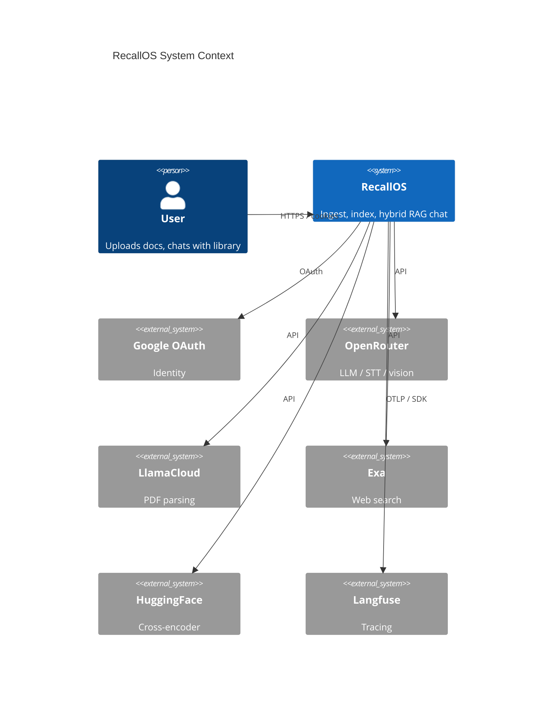

> If your Mermaid renderer does not support C4, use the flowchart in [Architecture §2](./architecture.md#2-high-level-system).

---

## Container diagram

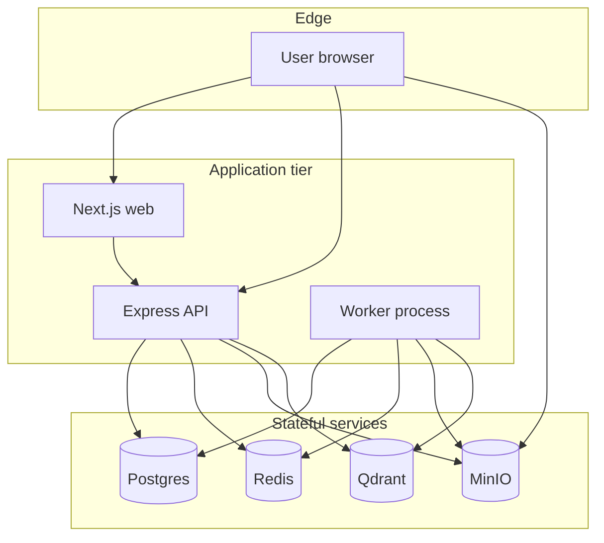

---

## Monorepo package graph

```mermaid
flowchart LR
  web[apps/web] --> ui[@repo/ui]
  backend[apps/backend] --> prisma[@repo/prisma]
  backend --> minio[@repo/minio]
  backend --> redis[@repo/redis-stream]
  backend --> qdrant[@repo/qdrant]
  backend --> embed[@repo/embed]
  backend --> openrouter[@repo/openrouter]
  backend --> langfuse[@repo/langfuse]
  workers[apps/workers] --> prisma
  workers --> minio
  workers --> redis
  workers --> qdrant
  workers --> embed
  workers --> openrouter
  workers --> langfuse
  prisma --> PG[(Postgres)]
  minio --> S3[(MinIO)]
  redis --> RD[(Redis)]
  qdrant --> QD[(Qdrant)]
```

---

## Ingestion data flow

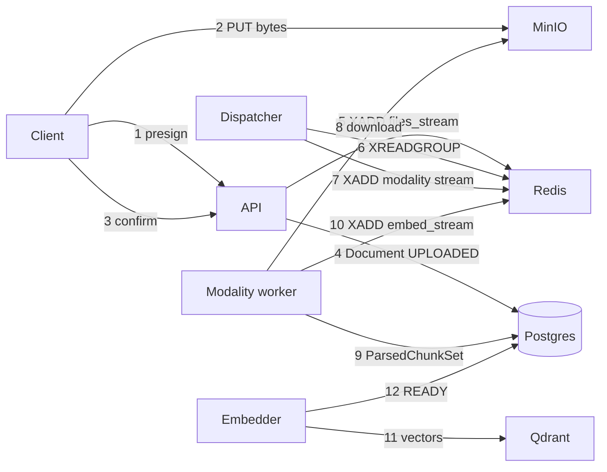

---

## Chat / RAG data flow

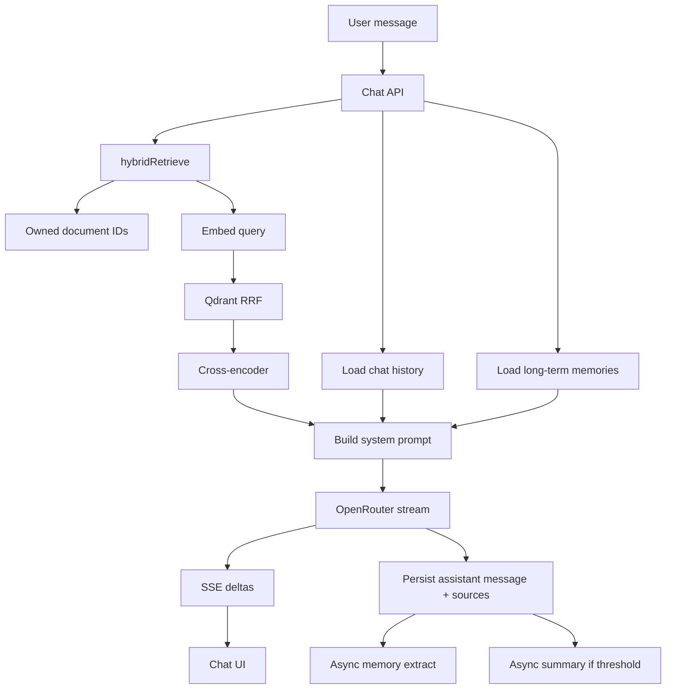

---

## Redis stream topology

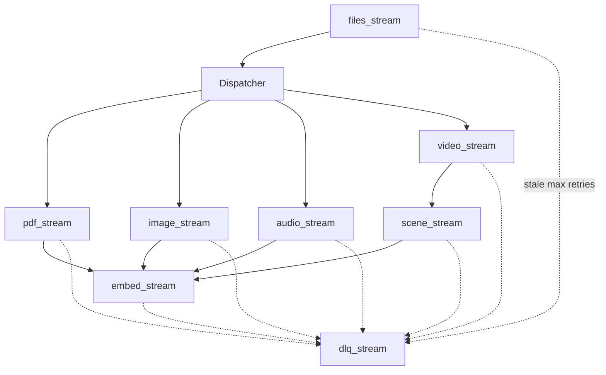

---

## Document status lifecycle

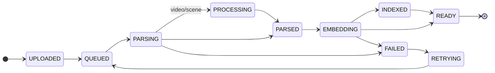

---

## Entity relationship

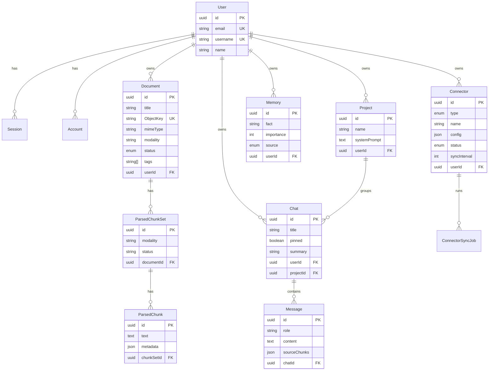

---

## Auth trust boundary

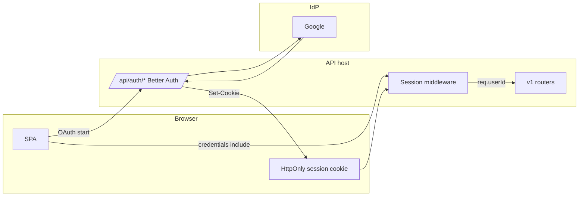

---

## Hybrid retrieval internals

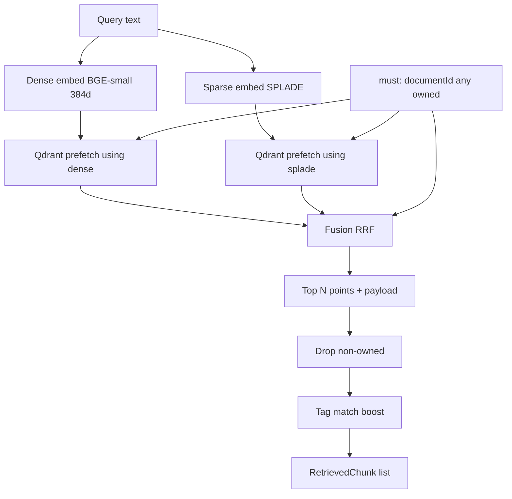

---

## Agent graphs

### Web agent (`/web`)

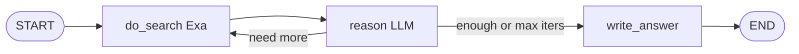

### Memory agent (`/agent`)

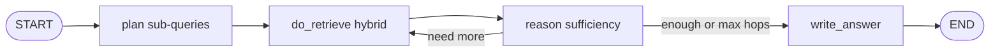

---

## Local development topology

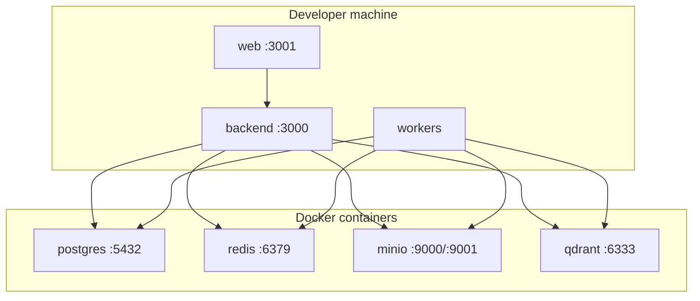

---

## Production deployment (reference)

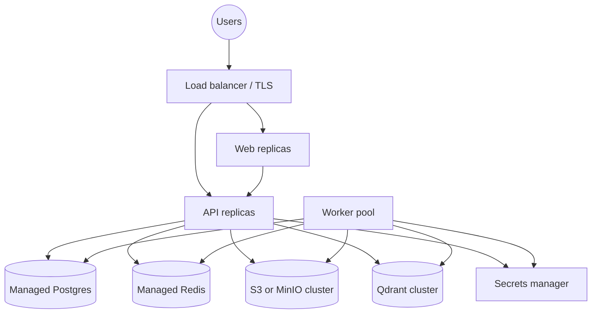

See [Deployment guide](./deployment.md) for concrete steps.
