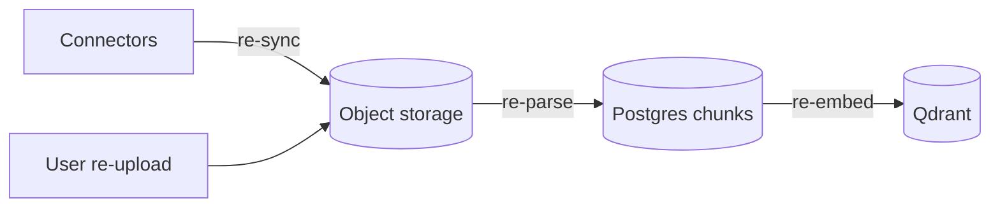

# Disaster recovery guide

Plans for data loss, service outage, and pipeline failure in RecallOS. Adjust RTO/RPO targets to your organization; defaults below are **guidance**, not guarantees.

---

## 1. Critical data classification

| Store | Data | Loss impact | Priority |
|-------|------|-------------|----------|
| **Postgres** | Users, sessions, documents metadata, chunks text, chats, memories, connectors | **Catastrophic** — system of record | P0 |
| **MinIO / S3** | Raw files | High — re-upload or re-sync connectors | P0 |
| **Qdrant** | Vectors + payloads | High but **rebuildable** from `ParsedChunk` rows | P1 |
| **Redis Streams** | In-flight jobs | Medium — in-progress ingest may stall; can requeue from DB | P2 |
| **Langfuse** | Traces | Low — analytics only | P3 |
| **Secrets** | API keys, auth secret | Critical if leaked; rotate | P0 (security) |

### Rebuild relationships



- If Qdrant is lost but Postgres chunks remain → **re-embed only**.  
- If MinIO is lost but Document rows remain → objects missing; re-upload or connector re-sync.  
- If Postgres is lost → restore from backup; object store alone is not enough for chats/users.

---

## 2. RTO / RPO targets (suggested)

| Scenario | RPO (max data loss) | RTO (time to recover) |
|----------|---------------------|------------------------|
| Single API/web pod crash | 0 | &lt; 5 min (restart / k8s) |
| Worker fleet down | 0 (queue backs up) | &lt; 15 min |
| Redis outage | In-flight jobs | &lt; 30 min; requeue from DB |
| Qdrant outage | 0 if restored from snapshot | &lt; 1–4 h; or rebuild |
| Postgres restore | Last successful backup | &lt; 1–4 h |
| Region failure | Depends on multi-region design | hours–days |

---

## 3. Backup strategy

### 3.1 Postgres (P0)

**What:** Continuous WAL archiving + daily full base backups (managed Postgres usually provides this).

**How (self-hosted example):**

```bash
# Logical backup (app-consistent enough for many cases)
pg_dump "$DATABASE_URL" -Fc -f "recallos-pg-$(date +%F).dump"

# Restore
pg_restore -d "$DATABASE_URL" --clean --if-exists recallos-pg-YYYY-MM-DD.dump
```

**Retention:** 7 daily + 4 weekly + 3 monthly (example).

**Verify:** Monthly restore to a scratch instance + `prisma migrate status`.

### 3.2 Object storage (P0)

- Enable **versioning** on the bucket.  
- Cross-region replication for production.  
- Lifecycle: keep noncurrent versions 30+ days.  

**MinIO:** `mc mirror` / site replication.

### 3.3 Qdrant (P1)

```bash
# Snapshot (API or UI) — schedule daily
# Store snapshots in durable object storage separate from live cluster
```

Rebuild alternative:

```text
For each ParsedChunkSet with status ready:
  XADD embed_stream { chunkSetId }
```

(Implement a maintenance script; not shipped yet.)

### 3.4 Redis (P2)

- Prefer **AOF** every second for stream durability.  
- Snapshots are optional; treat Redis as **ephemeral queue** if you can re-enqueue from Postgres `streamMessageId` / status.

### 3.5 Secrets

- Store only in secrets manager.  
- Document rotation procedure for `BETTER_AUTH_SECRET` (invalidates all sessions).  
- Rotate compromised API keys (OpenRouter, Llama, Google OAuth, Exa, HF).

---

## 4. Failure modes & runbooks

### 4.1 API process down

**Symptoms:** Web cannot load data; OAuth fails.

**Actions:**

1. Check process / container / health.  
2. Check logs for `BETTER_AUTH_SECRET`, DB connection.  
3. Restart API.  
4. Confirm `/api/auth` and `/api/v1` with session.

**Data loss:** None if DB healthy.

---

### 4.2 Workers down / lagging

**Symptoms:** Documents stuck in `UPLOADED` / `QUEUED` / `PARSING` / `EMBEDDING`.

**Actions:**

1. `docker ps` / process list — start workers.  
2. Confirm `REDIS_URL` and stream env vars match API.  
3. Check Redis: `XINFO GROUPS files_stream`, `XPENDING`.  
4. Check DLQ length.  
5. Fix root cause (LlamaCloud quota, ffmpeg missing, OOM).  
6. Stale claim loops should reprocess idle messages after threshold (~30 min idle, 5 retries default).

**Requeue stuck document (manual):**

```sql
-- Inspect
SELECT id, title, status, "ObjectKey", "streamMessageId" FROM "Document" WHERE status NOT IN ('READY','FAILED');
```

```bash
# Conceptual: XADD files_stream fields docId <uuid>
# Use redis-cli or a small admin script
```

---

### 4.3 Redis unavailable

**Symptoms:** Confirm upload may fail to enqueue; workers idle; connectors embed path fails.

**Actions:**

1. Restore Redis service.  
2. If data lost: for each Document with status `UPLOADED`/`FAILED` needing reprocess, re-`XADD` to `files_stream`.  
3. For `PARSED` without vectors, re-`XADD` to `embed_stream` with `chunkSetId`.

**Mitigation:** Managed Redis + multi-AZ; monitor connectivity.

---

### 4.4 MinIO / S3 unavailable

**Symptoms:** Upload PUT fails; workers fail download; downloads fail.

**Actions:**

1. Restore storage service / credentials.  
2. If bucket empty but Postgres intact: objects missing — notify users to re-upload; re-run connectors.  
3. If restored from backup: reconcile orphaned `Document` rows (status `FAILED` if HeadObject 404).

---

### 4.5 Qdrant unavailable or empty

**Symptoms:** Chat/search return no chunks; embedder errors.

**Actions:**

1. Restart Qdrant; restore latest snapshot if corrupted.  
2. If empty collection: recreate schema (dense dim 384 + sparse) then **re-embed all chunk sets**.  
3. Chat remains available with empty context until reindex completes.

---

### 4.6 Postgres corruption / loss

**Symptoms:** Total application failure.

**Actions:**

1. Stop API and workers (prevent write noise).  
2. Restore latest backup + WAL to recovery target.  
3. Run `prisma migrate status` (should be clean).  
4. Start API/workers.  
5. Reconcile MinIO (orphan objects OK; missing objects → FAILED).  
6. Rebuild Qdrant if timestamps indicate vectors newer than restore point.  

**Communication:** Users may lose chats/messages after RPO window.

---

### 4.7 Auth secret compromise

**Actions:**

1. Generate new `BETTER_AUTH_SECRET`.  
2. Deploy; all sessions invalid — users re-login.  
3. Audit `Session` table; optionally truncate sessions.  
4. Review access logs.

---

### 4.8 API key leak (OpenRouter / Llama / etc.)

**Actions:**

1. Revoke key at provider.  
2. Issue new key; update secrets; roll deploy.  
3. Check provider usage for abuse.  
4. Review Langfuse / logs for anomalous volume.

---

### 4.9 Connector SSRF attempt / abuse

**Symptoms:** Spikes in connector errors; unusual outbound traffic.

**Actions:**

1. Pause connectors: set status `PAUSED` in DB or API.  
2. Confirm SSRF guards in `security/ssrf.ts` deployed.  
3. Inspect `Connector.lastError` and configs (tokens redacted in API).  
4. Block offending user if multi-tenant abuse.

---

### 4.10 DLQ growth

**Symptoms:** `dlq_stream` filling; docs `FAILED`.

**Actions:**

1. Read DLQ payload / worker logs for root cause.  
2. Fix dependency (quota, model, bug).  
3. Reprocess: move message back or re-enqueue `docId` / `chunkSetId`.  
4. Document permanent poison pills (bad files) as `FAILED` without retry.

---

## 5. Disaster recovery drill calendar

| Drill | Frequency | Success criteria |
|-------|-----------|------------------|
| API restart | Monthly | Service recovers &lt; 5 min |
| Postgres restore to staging | Quarterly | App boots; sample user login |
| Qdrant rebuild from chunks | Semi-annual | Search returns expected docs |
| Secret rotation | Annual / as needed | Login works; no residual key use |
| Backup restore integrity | Monthly automated check | Backup non-empty + restorable |

---

## 6. Incident command checklist

```text
1. Detect  — alert / user report
2. Triage  — which store / which component?
3. Contain — pause writers if data integrity at risk
4. Communicate — status page / users if user-facing
5. Recover — runbook above
6. Verify  — OAuth, upload, READY, chat with sources
7. Postmortem — root cause, action items, update this doc
```

---

## 7. Maintenance scripts (recommended to add)

Not currently in the repo; useful ops tools:

| Script | Purpose |
|--------|---------|
| `requeue-document.ts` | `XADD files_stream` for a `docId` |
| `reembed-all.ts` | All `ParsedChunkSet` → `embed_stream` |
| `reconcile-storage.ts` | HeadObject for each Document; mark missing FAILED |
| `purge-user.ts` | GDPR delete: DB + MinIO + Qdrant |

---

## 8. Contacts & dependencies

Maintain a private runbook with:

- Cloud account owners  
- Domain / TLS owners  
- Provider dashboards (OpenRouter, LlamaCloud, Google Cloud OAuth, Exa, Langfuse)  
- On-call rotation  

---

## 9. Related documentation

- [Deployment](./deployment.md)  
- [Architecture](./architecture.md)  
- [Security audit](../audit.md)  
- [Onboarding](./onboarding.md)  

---

*Keep this guide updated when stream names, retention policies, or hosting topology change.*
