# Sequence diagrams

End-to-end interaction flows for RecallOS. Companion to [Architecture](./architecture.md) and [API](./api.md).

---

## 1. Google OAuth sign-in

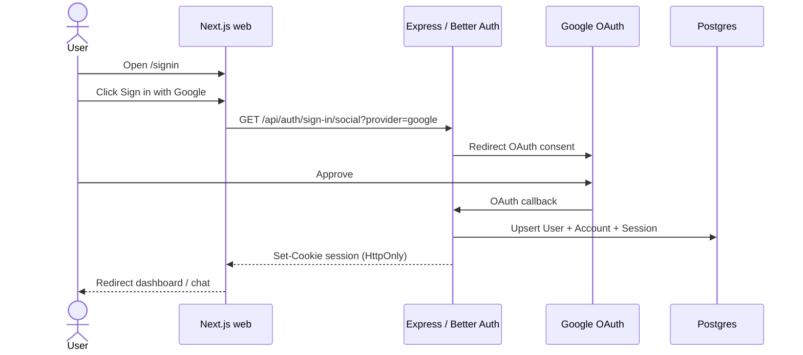

---

## 2. Authenticated API request

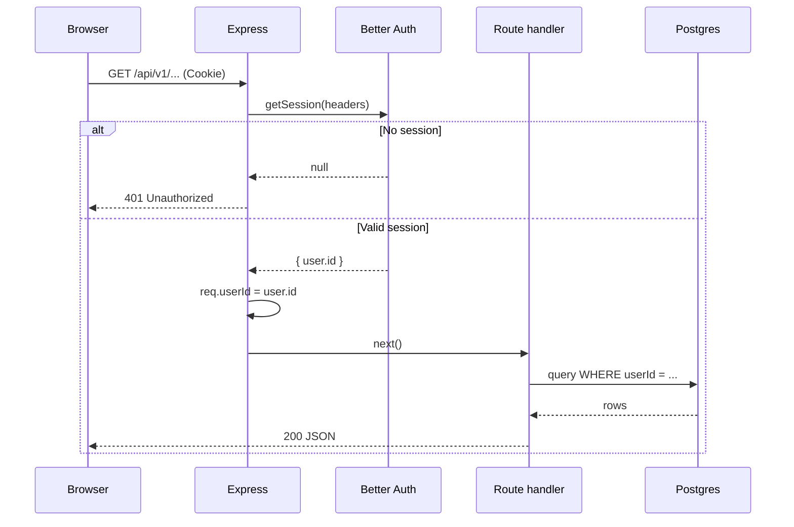

---

## 3. Document upload (presigned MinIO)

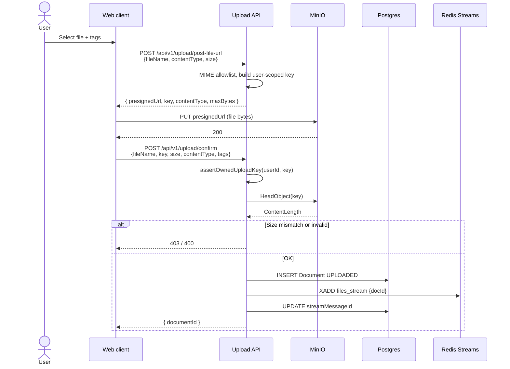

---

## 4. Ingestion: dispatcher → parser → embedder

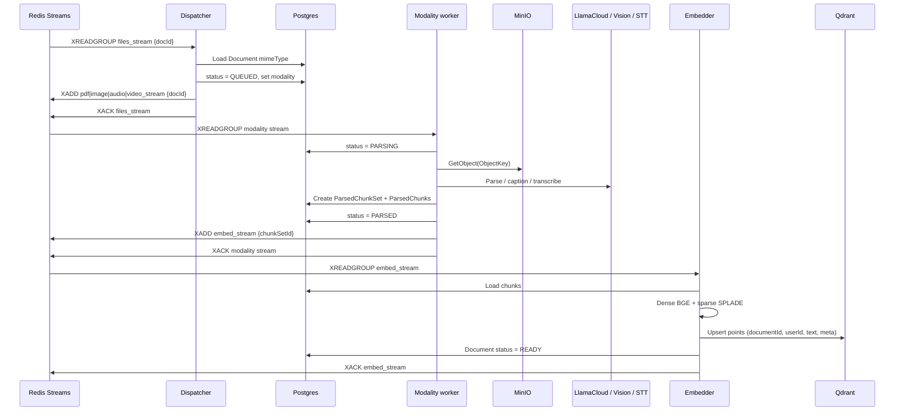

---

## 5. Stale job reclaim and DLQ

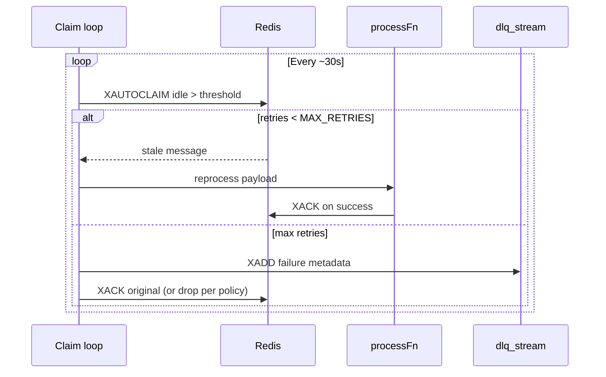

---

## 6. Default RAG chat (SSE)

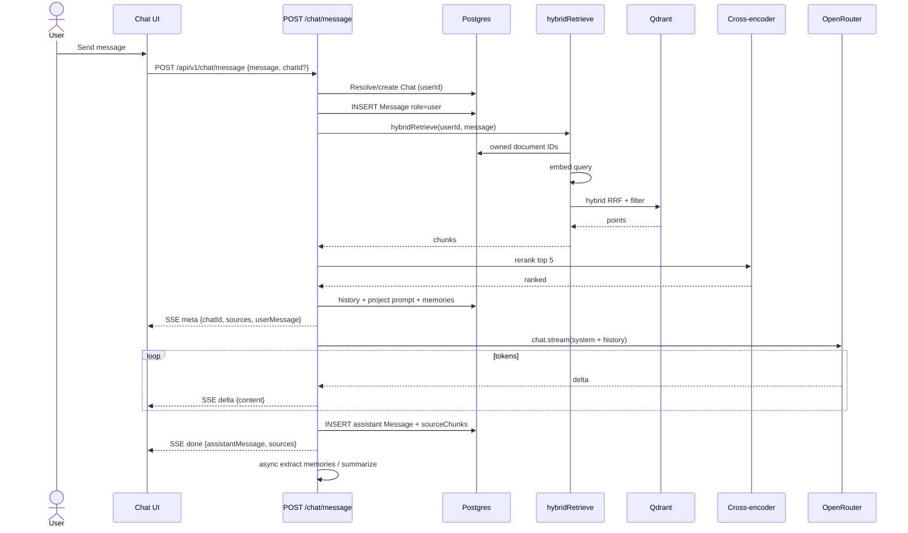

---

## 7. Web research agent (`/web`)

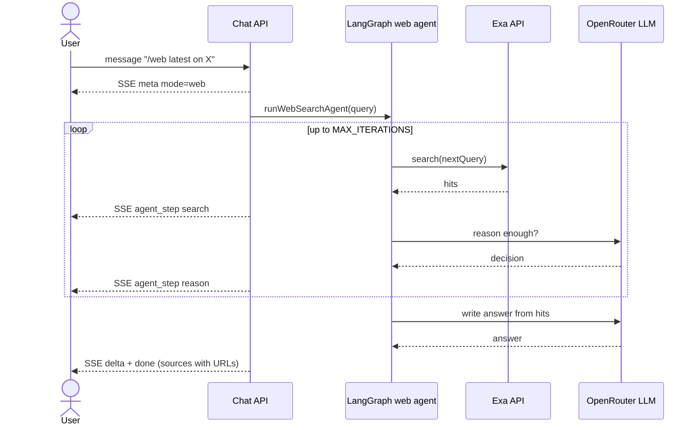

---

## 8. Multi-hop memory agent (`/agent`)

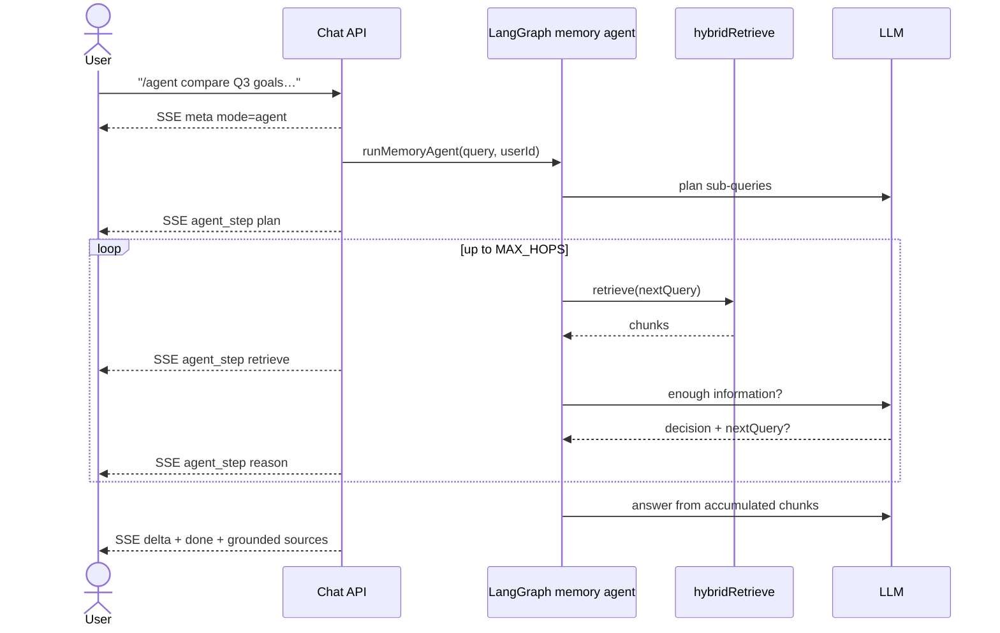

---

## 9. Document search (library UI)

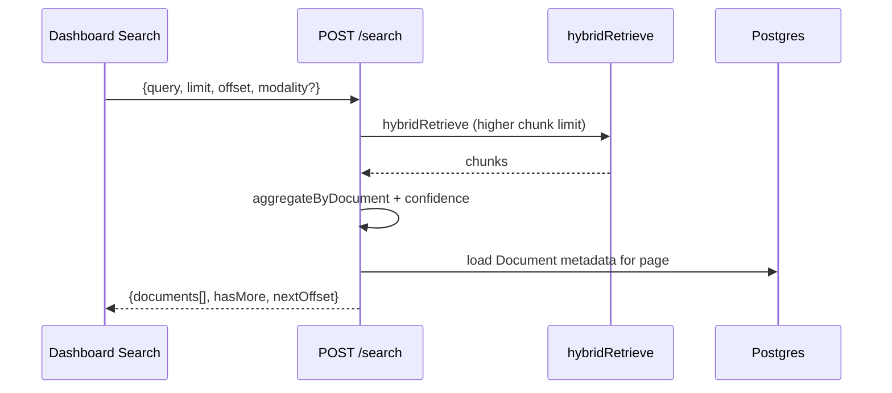

---

## 10. Download and delete document

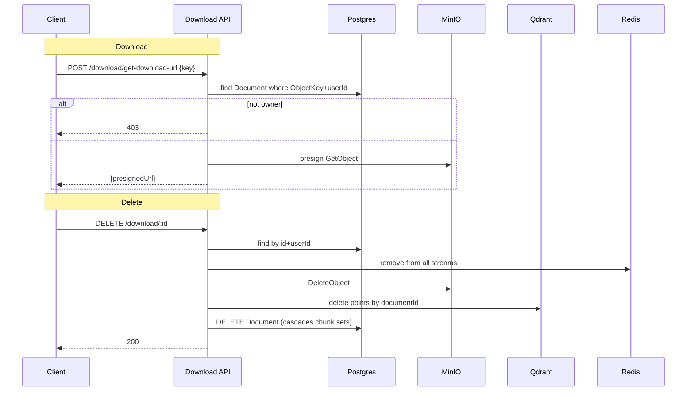

---

## 11. Connector create and continuous sync

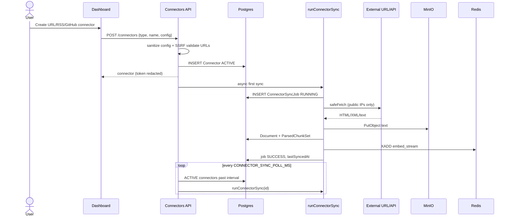

---

## 12. Long-term memory extract (post-chat)

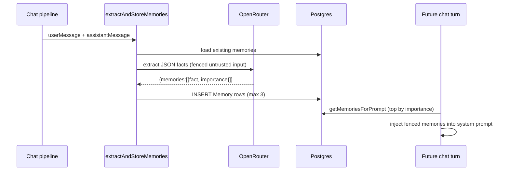

---

## Legend

| Arrow style | Meaning |
|-------------|---------|
| Solid | Synchronous request/response |
| SSE notes | Server-Sent Events stream to client |
| Async | Fire-and-forget after response (memories, first connector sync) |
