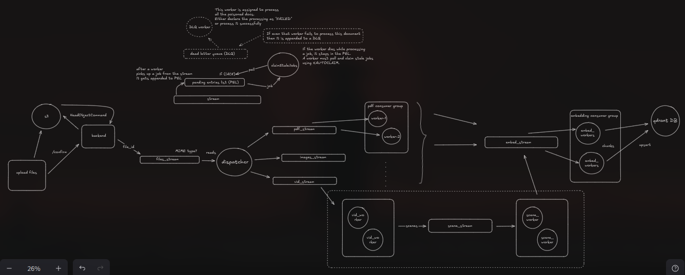

# New architecture:



# RecallOS Ingestion Architecture Specification

## Goals

* Asynchronous ingestion
* Horizontal scalability
* Support PDFs, images, videos, audio, future modalities
* Retry-safe
* Re-embeddable without reparsing
* Fault tolerant using Redis Streams
* Easy to extend

---

# Components

## Storage

* **MinIO**

  * Stores uploaded assets.
  * Never stores parsed text.
  * Referenced by object key.

---

## Metadata DB (Postgres)

Stores

```ts
Document
--------
id
mimeType
objectKey
status
ownerId
createdAt
updatedAt
```

Future tables

```ts
ParsedChunkSet
--------------
id
documentId
modality
status
createdAt
```

```ts
ParsedChunk
-----------
id
chunkSetId
text
metadata(JSON)
```

---

# Upload Flow

```text
Frontend
    │
Upload
    │
MinIO
    │
confirm()
    │
HeadObject
    │
Document row
    │
XADD(files_stream)
```

Only the `docId` is pushed.

```json
{
  "docId": "..."
}
```

---

# Dispatcher

Consumes

```
files_stream
```

Responsibilities

* Read docId
* Fetch metadata
* Determine MIME type
* Route to correct stream
* ACK original message

Example

```
application/pdf

↓

pdf_stream
```

```
image/png

↓

image_stream
```

```
video/mp4

↓

video_stream
```

```
audio/mp3

↓

audio_stream
```

Dispatcher performs **no parsing**.

---

# Parser Workers

Each modality owns its own consumer group.

```
pdf_stream

↓

pdf consumer group
```

```
image_stream

↓

image consumer group
```

etc.

Responsibilities

* Download asset from MinIO
* Parse asset
* Generate ParsedChunkSet
* Store ParsedChunkSet
* Push chunkSetId onto embed_stream
* ACK original stream message

No embeddings happen here.

---

# PDF Worker

Pipeline

```
Download PDF

↓

LlamaParse

↓

Semantic Chunking

↓

ParsedChunkSet

↓

Database

↓

embed_stream
```

---

# Image Worker

Pipeline

```
Download Image

↓

Vision Model

↓

OCR

↓

Description

↓

ParsedChunkSet

↓

Database

↓

embed_stream
```

Metadata example

```json
{
  "page": 4,
  "caption": "...",
  "ocr": "...",
  "boundingBoxes": []
}
```

---

# Audio Worker

Pipeline

```
Download Audio

↓

Whisper

↓

Transcript

↓

Semantic Chunking

↓

ParsedChunkSet

↓

embed_stream
```

---

# Video Worker

Pipeline

```
Download Video

↓

Scene Detection

↓

scene_stream
```

Video workers only split videos.

---

# Scene Workers

Pipeline

```
Scene

↓

Keyframe Extraction

↓

OCR

↓

Vision Model

↓

Transcript

↓

ParsedChunkSet

↓

embed_stream
```

Each scene becomes a semantic chunk.

---

# Embedding Workers

Single consumer group.

Consumes

```
embed_stream
```

Receives

```json
{
    "chunkSetId": "..."
}
```

Pipeline

```
Load ParsedChunkSet

↓

Dense Embedding

↓

Sparse Embedding

↓

Upsert

↓

Qdrant
```

Embedding workers are completely modality-agnostic.

---

# Vector Database

Stores

```
Dense Vector

Sparse Vector

Payload
```

Payload

```json
{
    "documentId": "...",
    "chunkId": "...",
    "modality": "image",
    "page": 4,
    "timestampStart": 15.3,
    "timestampEnd": 21.1
}
```

---

# Redis Streams

```
files_stream
```

↓

```
pdf_stream
image_stream
video_stream
audio_stream
```

↓

```
scene_stream
```

↓

```
embed_stream
```

---

# Consumer Groups

Each stream owns its own consumer group.

```
pdf_stream

↓

pdf-workers
```

```
image_stream

↓

image-workers
```

```
video_stream

↓

video-workers
```

```
scene_stream

↓

scene-workers
```

```
embed_stream

↓

embedding-workers
```

Workers are stateless and horizontally scalable.

---

# Failure Handling

Redis Streams automatically place delivered-but-unacked messages into the **Pending Entries List (PEL)**.

If a worker dies:

```
Job

↓

PEL
```

Healthy workers periodically execute

```
XAUTOCLAIM
```

to reclaim stale jobs.

If processing repeatedly fails after a configured retry limit:

```
Job

↓

Dead Letter Queue
```

A dedicated **DLQ worker** processes poisoned documents by either:

* successfully reprocessing them, or
* marking the document as `FAILED`.

If the DLQ worker also cannot recover the document, it remains in the DLQ for manual inspection.

---

# Document Lifecycle

```
UPLOADED

↓

QUEUED

↓

PARSING

↓

PARSED

↓

EMBEDDING

↓

INDEXED

↓

READY
```

UI progress can be derived directly from these states.

---

# Design Principles

* Streams carry **IDs only**, never large payloads.
* Parsing and embedding are separate stages.
* Embedding workers are unaware of document modality.
* Every stage is independently scalable.
* Every stage can be retried independently.
* New modalities (PowerPoint, HTML, Git repositories, ZIPs, emails) only require a new parser that emits a `ParsedChunkSet`; the downstream embedding and indexing pipeline remains unchanged.